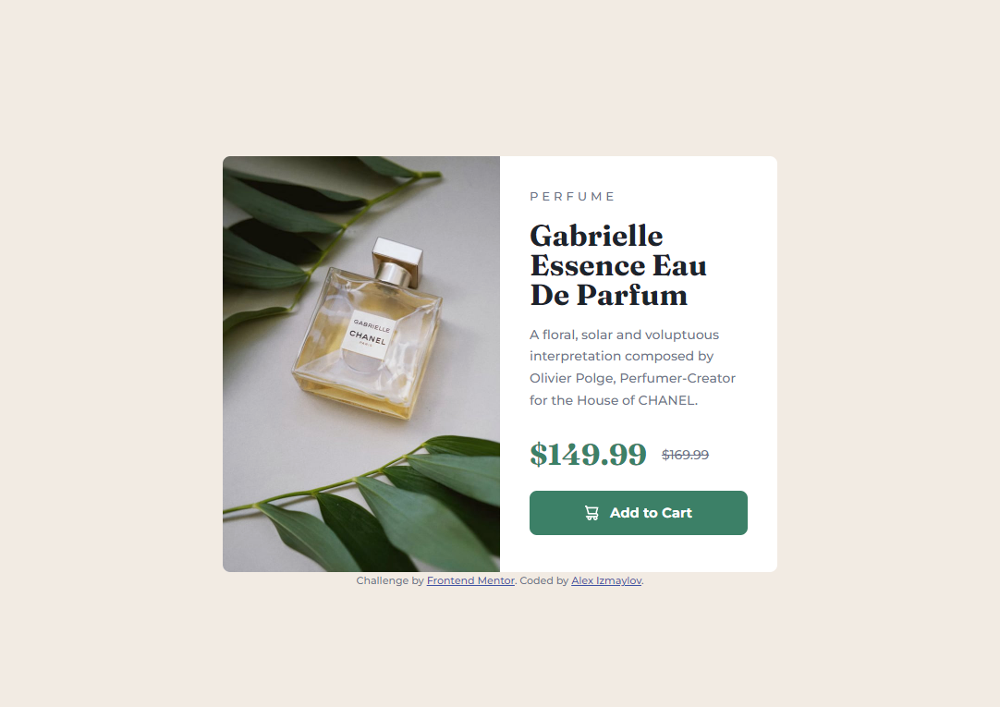

# Frontend Mentor - Product preview card component solution

This is a solution to the [Product preview card component challenge on Frontend Mentor](https://www.frontendmentor.io/challenges/product-preview-card-component-GO7UmttRfa). Frontend Mentor challenges help you improve your coding skills by building realistic projects. 

## Table of contents

- [Overview](#overview)
  - [The challenge](#the-challenge)
  - [Screenshots](#screenshots)
  - [Links](#links)
- [My process](#my-process)
  - [Built with](#built-with)
  - [What I learned](#what-i-learned)
  - [Continued development](#continued-development)
  - [Useful resources](#useful-resources)
- [Author](#author)
- [Acknowledgments](#acknowledgments)

**Note: Delete this note and update the table of contents based on what sections you keep.**

## Overview

### The challenge

Users should be able to:

- View the optimal layout depending on their device's screen size
- See hover and focus states for interactive elements

### Screenshots

### Links

- Solution URL: [GitHUB](https://github.com/DekhanFraser/FM-NB-Product-preview-card-component)
- Live Site URL: [Netlify](https://profound-starburst-8b69f6.netlify.app/)

## My process

### Built with

- Semantic HTML5 markup
- CSS custom properties
- Flexbox
- CSS Grid
- Mobile-first workflow

### What I learned

This is my first project that I made after learning the basics of HTML and CSS. I used some guidance from online documentation and YouTube videos for tips and tricks on good practices. 

My biggest lessons here are the following:
- CSS reset
- BEM naming convention
- CSS variables
- rem / em relative sizing

I tried to get the design as close as possible to the original while still using relative sizing instead of pixel perfect alignments.

### Continued development

Since this was my first project, I used online guidance from videos and advice from my developer friends. My focus for the next projects will be to implement as much as possible without asking for help.

### Useful resources

- [CSS Reset](https://www.joshwcomeau.com/css/custom-css-reset/) - This helped me wrap m head around using CSS resets. 

## Author

- GitHUB - [DekhanFraser](https://github.com/DekhanFraser)
- Frontend Mentor - [@DekhanFraser](https://www.frontendmentor.io/profile/DekhanFraser)

## Acknowledgments

Big shoutout to Kevin Powell on Youtube for an awesome front-end developer channel with lots of tips & tricks, as well as in-depth guides.
